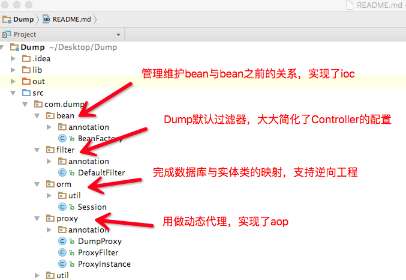
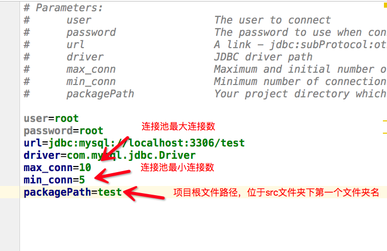

# Dump－一个轻量级mvc框架

## Info

Dump是一个轻量级mvc框架, 正如它的名字一样, Simple is everything.Dump是一个完全基于注解开发的
框架, 他甚至没有自己的xml文件,一切基于注解。Dump的灵感来源与Spring mvc, Hibernate和Spring, 
所以操作上可能找到很多它们的影子。同样,依据Spring mvc, Hibernate和Spring, Dump也分为三个模块,
它们各执其责, 相互配合完成整个工作。

## Structure



## How To Use

### jar包下载

你可以clone本项目到你的路径下, 也可以导入jar包, [点此下载](https://pan.baidu.com/s/1dEKYNyp),除了项目本身的jar包,项目还依赖于
`cglib.jar`和`asm.jar`用于实现动态代理。其jar包文件在本仓库lib文件夹下,可直接下载。

### 配置文件

项目唯一需要你配置的就是数据库的配置文件, 配置文件名为`jdbc.properties`,位于src目录下,配置项如下。



当然`web.xml`文件也要配置为Dump默认的Filter,代码如下
```
    <servlet>
        <servlet-name>dump</servlet-name>
        <servlet-class>com.dump.filter.DefaultFilter</servlet-class>
        <load-on-startup>1</load-on-startup>
    </servlet>
    <servlet-mapping>
        <servlet-name>dump</servlet-name>
        <url-pattern>*.action</url-pattern>
    </servlet-mapping>
```
好了,只需两个步骤,你已经完成了Dump所需的所有配置工作,下面来看看如何使用吧!

## Controller

和Spring mvc用法几乎相同, 使用`@Controller`来表示它是一个控制器类,`@RequestMapping`用于匹配它的url,
`@Param`用于匹配表单的name值,当然,和Spring mvc一样, 你也可以直接传人具体类来自动填充属性值。下面展示了这三个
基本注解的使用。
```
@Controller
public class TestController {
    @RequestMapping("/a")
    public String login(Student student,@Param("name")String name, HttpServletRequest request){
        studentService.test();
        return "/index.jsp";
    }
}
```

## ORM

对于对象关系映射, Dump也提供了基本的函数操作, 包括分页操作, 而相对复杂的查询工作还是依赖于sql语句,但再也不用你来创建对象了,
这位你节省下很大的工作量。基本函数如有:`save()`, `delete()`, `update()`, `load()`, `getCount()`, `getAll()`, `selectBysql()`, 
`selectByPage()`。其中的用法,参数,实现功能和Hibernate完全一致,在此不做赘述。

逆向工程:Dump支持自动填充Model层代码完成映射,只需要在任何位置运行以下代码:
```
    public static void main(String[] args) throws Exception{
        //第一个参数为表名,第二个参数为生成的文件路径
        SqlCreater.createModel("student","com.model");
        SqlCreater.createModel("teacher","com.model");
    }
```

## IOC/AOP

IOC和AOP是Spring的核心,在此Dump也提供了对其的支持。

1.IOC

利用注解`@Autowired`进行自动装备, 与Spring不同,`@Autowired`需要修饰需要注入的类, 而类里含有set方法的属性,字段
将自动注入。

2.AOP

AOP及动态代理的实现基于`@Aspect`,`@PointCut`,`@Before`,`@After`. `@Aspect`用于定义切面,用`@Aspect`修饰的
类将自动注入代理类,而需要被代理的方法用`@PointCut`修饰, `@Before`和`@After`用于制定通知,处理代理函数。基本注解的
用法和Spring相同,在此也不做赘述。


**以上为Dump的基本功能以及用法介绍, Dump还有很多特性以及细节这里未能提及到, 想具体了解的可以fork本项目
参与开发,也可以浏览用于本项目完成的[Demo实例](),喜欢的可以给我点个star给予支持, 欢迎大家提出宝贵意见。**

**另外,我的博客有关于此项目的具体实现细节讲解,欢迎浏览。**

**[My Blog](http://yuanguangxin.me)**


 
