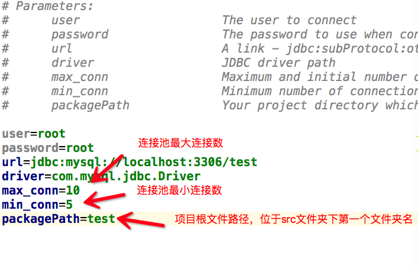

# Dump－一个轻量级mvc框架

**快速了解可根据文档阅读Demo: [A Demo of Dump](https://github.com/yuanguangxin/DumpDemo)**

## Info

Dump是一个轻量级mvc框架, 正如它的名字一样, Simple is everything.Dump是一个轻配置,完全基于注解开发的
框架, 他甚至没有自己的xml文件,一切基于注解。Dump分为三个模块, 它们各执其责, 相互配合完成整个工作。当然,
三个模块也相互独立,完全解藕,可根据需要自行设定选择。

## Structure


## How To Use

### Maven

```xml
<dependency>
    <groupId>group.dump</groupId>
    <artifactId>Dump</artifactId>
    <version>1.2</version>
</dependency>
```

### jar包下载

你可以clone本项目到你的路径下, 也可以导入jar包, [点此下载](https://pan.baidu.com/s/1jIvxiPS),除了项目本身的jar包,项目还依赖于
`cglib.jar`和`asm.jar`用于实现动态代理。其jar包文件在本仓库lib文件夹下,可直接下载。

### 配置文件

项目唯一需要你配置的就是数据库的配置文件, 配置文件名为`jdbc.properties`,位于src目录下,配置项如下。



**注:配置项packageName的配置内容不能等于Dump的默认包名,即不能等于com.**

当然`web.xml`文件也要配置为Dump默认的Filter,代码如下
```xml
    <servlet>
        <servlet-name>dump</servlet-name>
        <servlet-class>com.dump.filter.DefaultFilter</servlet-class>
        <load-on-startup>1</load-on-startup>
    </servlet>
    <servlet-mapping>
        <servlet-name>dump</servlet-name>
        <url-pattern>*.action</url-pattern>
    </servlet-mapping>
```
好了,只需两个步骤,你已经完成了Dump所需的所有配置工作,下面来看看如何使用吧!

## Controller

和Spring mvc用法几乎相同, 使用`@Controller`来表示它是一个控制器类,`@RequestMapping`用于匹配它的url,
`@Param`用于匹配表单的name值,当然,和Spring mvc一样, 你也可以直接传人具体类来自动填充属性值。
需要注意的是,Dump中Controller可传递的参数代表其url路径(对应spring mvc里的RequestMapping),而Dump的RequestMapping只
能修饰Controller内的函数。Controller和RequestMapping都支持多组url映射。例：`@Controller({"/user","/friend"})`

示例代码:
```java
@Controller
public class UserController {
    private UserService userService = new UserService();
    
    //Ajax传值,返回值为void
    @RequestMapping("/register")
    public void register(User user, @Param("again") String again,
                        HttpServletResponse response) throws Exception {
        String result = userService.register(user, again);
        response.getWriter().print(result);
    }
    
    //Post或Get传值,返回值为String
    @RequestMapping("/login")
    public String login(HttpSession session,
                        HttpServletResponse response,
                        User user) throws Exception{
        User us = userService.login(user);
        if(us == null){
            //重定向返回页面
            return "redirect:/error.jsp";
        }else{
            //request转发跳转页面
            return "success.jsp";
        }
    }
}
```

## ORM

对于对象关系映射, Dump也提供了基本的函数操作, 包括分页操作, 而相对复杂的查询工作还是依赖于sql语句,但再也不用你来创建对象了,
这位你节省下很大的工作量。基本函数如有:`save()`, `delete()`, `update()`, `load()`, `getCount()`, `getAll()`, `selectBysql()`, 
`selectByPage()`。

示例代码:
```java
public class UserDao {
    public User login(User user){
        List<User> list = Session.getSession().selectBysql("select * from user where username = ? and password = ?",User.class,user.getUsername(),user.getPassword());
        //Session.getSession().save(user);//把user加入数据库中
        //Session.getSession().load(User.class,2);加载id为2的User(删除delete,更新update同理)
        //Session.getSession().getAll(User.class);得到数据库里user的所有映射类(getCount同理)
        //Session.getSession().selectByPage("select * from user",User.class,int pageNo, int pageSize);//得到指定页制定大小的实体类列表
        if(list.size()!=0){
            return list.get(0);
        }else {
            return null;
        }
    }
}
```

逆向工程:Dump支持自动填充Model层代码完成映射,只需要在任何位置运行以下代码:
```java
public class Test{
    public static void main(String[] args) throws Exception{
        //第一个参数为表名,第二个参数为生成的文件路径
        SqlCreater.createModel("student","com.model");
        SqlCreater.createModel("teacher","com.model");
    }
}
```

## IOC/AOP

IOC和AOP是Spring的核心,在此Dump也提供了对其的支持。

1.IOC

利用注解`@Autowired`进行自动装备, 与Spring不同,`@Autowired`需要修饰需要注入的类, 而类本身和类里含有set方法的属性,字段
将自动注入。

示例代码:
```java
@Autowired
@Controller
public class UserController {
    private UserService userService;
    
    public void setUserService(UserService userService) {
        this.userService = userService;
    }
    
}
```

2.AOP

AOP及动态代理的实现基于`@Aspect`,`@PointCut`,`@Before`,`@After`. `@Aspect`用于定义切面,用`@Aspect`修饰的
类将自动注入代理类,而需要被代理的方法用`@PointCut`修饰, `@Before`和`@After`用于制定通知,处理代理函数。如果你对
Spring非常熟悉,那么它的使用对你非常简单。

示例代码:
```java
@Autowired
@Aspect
public class UserDao {
    
    @Pointcut
    public User login(User user){
        System.out.println("login()");
        List<User> list = Session.getSession().selectBysql("select * from user where username = ? and password = ?",User.class,user.getUsername(),user.getPassword());
        if(list.size()!=0){
            return list.get(0);
        }else {
            return null;
        }
    }
    
    @Before
    public void before(User user){
        System.out.println(user.getUsername()+"正在登录");
    }
    
    @After
    public void after(User user){
        System.out.println("After login()");
    }
}
```

## V1.1更新(2016.08.18)

1.增加拦截器接口,用于实现权限管理

示例:
```java
@Handle({".*.action",".*.html"})
@Except(".*test.action")
public class BaseHandle implements Interceptor{
    @Override
    public boolean preHandle(HttpServletRequest request, HttpServletResponse response) throws ServletException, IOException {
        if(request.getSession.getAttribute("user")==null){
            request.getRequestDispatcher("/tests.jsp").forward(request, response);
            return false;
        }else return true;
    }
}
```
Handle和Except都支持写入多组url或正则表达式进行url匹配, `@Handle`表示你想要拦截的url,`@Except`表示你要
除去的url(不拦截的), 拦截器统一实现Interceptor接口,并通过重写preHandle方法进行拦截,若返回值为false表明拦截并
跳过action(Controller)层方法,返回为true则正常执行。

2.简化查询语句

示例:
```java
public class UserDao {
    @Pointcut
    public User login(User user){
        //第一个参数调整为查询条件
        List<User> list = Session.getSession().selectBysql("username = ? and password = ?",User.class,user.getUsername(),user.getPassword());
        if(list.size()!=0){
            return list.get(0);
        }else {
            return null;
        }
    }
}
```

## V1.2更新(2017.09.29)

1.Maven重构

2.性能优化

以上为Dump的基本功能以及用法介绍，Dump还有很多特性以及细节这里未能提及到。

**想具体了解的可以fork本项目参与开发，也可以浏览用于本项目完成的[Demo实例](https://github.com/yuanguangxin/DumpDemo)，喜欢的可以给我点个star给予支持，欢迎大家提出宝贵意见。**

**另外，我的博客发表了关于Dump的具体细节以及实现思路，欢迎浏览。**

**[My Blog](http://yuanguangxin.me)**


 
